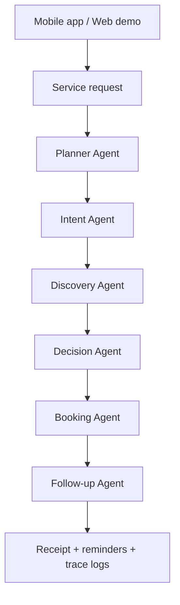

# Khadmat AI

Khadmat AI is an agentic AI service orchestrator for Pakistan's informal economy. It understands Urdu, Roman Urdu, and English service requests, finds nearby providers, ranks the best option, simulates booking, and schedules follow-up automation.

Primary deliverable: **mobile app** in `mobile/`  
Optional web/PWA demo: `/mobile` and `/chat` in the Next.js app

## Demo Request

```text
Mujhe kal subah G-13 mein AC technician chahiye
```

Expected result:

- Service: AC Technician
- Location: G-13, Islamabad
- Time: Tomorrow morning
- Recommended provider: Ali AC Services
- Reasoning: closest available AC provider with strong rating and job history
- Booking: confirmed mock receipt
- Follow-up: reminder and completion confirmation scheduled
- Trace: planner, intent, discovery, decision, booking, and follow-up agents

## Architecture



## How Google Antigravity Is Used

The project is structured around an Antigravity-style orchestration pipeline:

1. Planner Agent creates the workflow.
2. Intent Agent extracts service type, location, time, and language.
3. Discovery Agent calls a mock Maps/Places provider dataset.
4. Decision Agent ranks candidates by availability, distance, rating, slot match, and completed jobs.
5. Booking Agent writes a mock booking record and receipt.
6. Follow-up Agent schedules reminder, provider notification, and completion check.

The implementation exposes traceable logs for every step in `trace_steps`, and sample Antigravity artifacts are in `antigravity-traces/`.

## Run Mobile App

```bash
cd mobile
npm install
npm run start
```

Scan the Expo QR code with Expo Go, or run on Android:

```bash
npm run android
```

The mobile app imports the shared orchestrator from `../lib/agentic.ts`.

## Run Optional Web/PWA Demo

```bash
npm install
npm run dev
```

Open:

- `http://localhost:3000/mobile`
- `http://localhost:3000/chat`

The PWA manifest starts at `/mobile`, so it can be installed to a phone home screen.

## Run Backend API

The backend works in mock mode by default, so Supabase secrets are not required for the hackathon demo.

```bash
pip install -r backend/requirements.txt
npm run backend
```

Test endpoint:

```bash
curl -X POST http://localhost:8000/api/process \
  -H "Content-Type: application/json" \
  -d '{"message":"Mujhe kal subah G-13 mein AC technician chahiye"}'
```

## Key Files

- `mobile/App.tsx` - standalone Expo mobile app
- `app/mobile/page.tsx` - installable mobile-first PWA demo
- `app/chat/page.tsx` - optional web chat demo
- `app/api/process/route.ts` - local Next.js API route
- `lib/agentic.ts` - shared orchestrator and ranking logic
- `backend/agents/` - FastAPI agent pipeline
- `antigravity-traces/` - implementation plan, walkthrough, task list, sample trace

## APIs and Tools

- Google Antigravity workflow concept for orchestration and traceability
- Mock Google Maps/Places style provider dataset
- Mock booking system and reminder scheduler
- Optional Supabase integration remains in the backend, but mock mode is enabled by default

## Assumptions and Limitations

- Real Google Maps, Places, WhatsApp, SMS, and payment APIs are mocked for demo safety.
- Provider data is synthetic and contains no real personal data.
- The booking is simulated but produces a clear state change: booking reference, selected provider, slot, receipt, reminder, and follow-up plan.
- Expo cloud builds or APK export require the team's Expo/EAS credentials if a production APK is needed.
